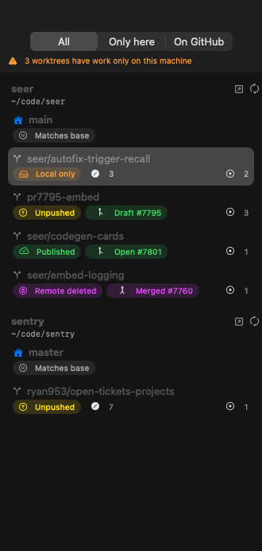
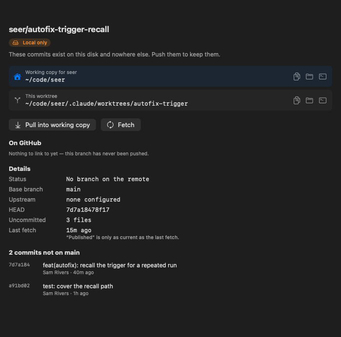
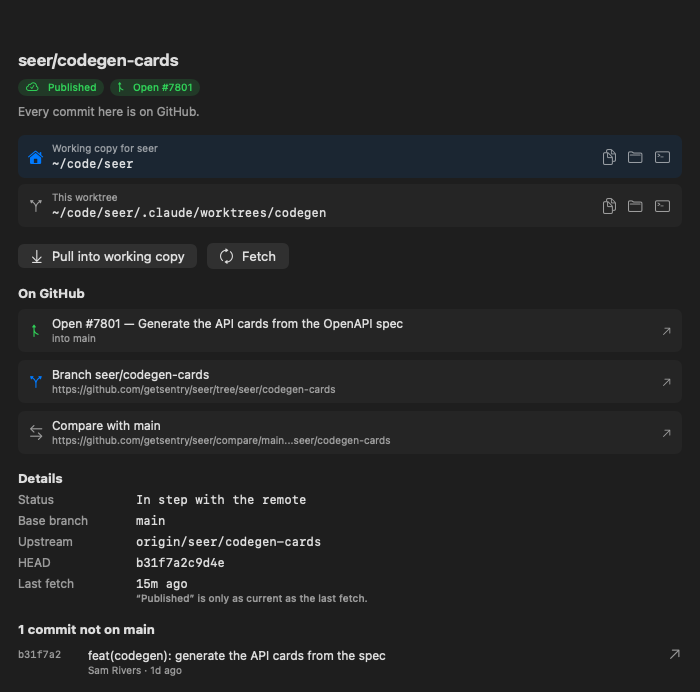
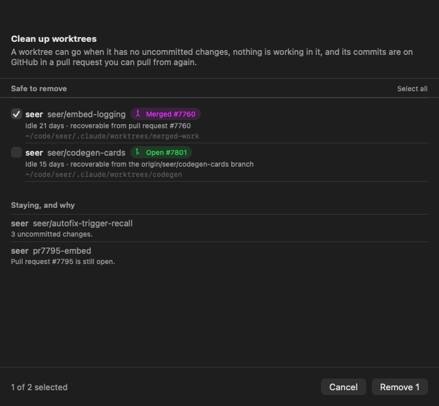
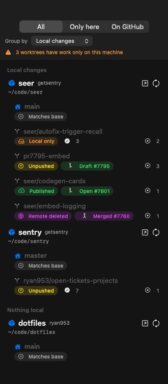

# Worktrees

A native macOS app that lists every git worktree on your machine and answers the one
question that matters about each: **is this work anywhere but this disk?**

| | |
| --- | --- |
|  |  |

## What it shows

Worktrees are easy to accumulate and easy to forget, and the cost of forgetting one is
losing work that was never pushed. So the app keeps two facts apart rather than blending
them into a single "status":

- **Unique commits** — commits on this branch that the base branch does not have
  (`origin/main..HEAD`).
- **Pushed** — whether those commits exist on the remote, read from git's own
  remote-tracking refs.

Every worktree lands in one of these:

| Status | What it means |
| --- | --- |
| **Matches base** | Nothing here the base branch does not already have. |
| **Local only** | Commits that exist on this disk and nowhere else. |
| **Unpushed** | The branch is on GitHub, but missing some of these commits. |
| **Published** | Every commit here is on GitHub. |
| **Remote deleted** | Pushed once, then deleted — what a merged pull request leaves behind. |
| **Detached** | No branch checked out, so there is nothing to push. |

"Local only" and "Unpushed" are the two that can lose work, so they sort to the top and
the sidebar keeps a running count of them.

For anything that reached GitHub you get links to the pull request, the branch, and the
comparison against the base branch — and for pushed work with no pull request yet, a
link that opens one.



## Where your working copy is

Every repository group names its main working copy directory, and the detail pane keeps
it at the top with buttons to copy it, reveal it in Finder, or open a terminal there. It
is never more than a glance away, whichever worktree is selected.

### Pulling a branch into the working copy

Git will not check out a branch that is already checked out in a worktree, so the
**Pull into working copy** button offers the two honest ways around that, and shows the
exact commands before running anything:

- **Move the branch here** — detaches the worktree so the branch is free, then checks it
  out in the working copy. Commits you make afterwards land on the branch. The worktree
  keeps its files.
- **Check out the commit here** — checks out the same commit with a detached HEAD and
  leaves the worktree completely alone. Good for reading and running the code.

Both refuse to run over uncommitted changes, and the move puts the worktree back on its
branch if the checkout fails.

## Cleaning up

Worktrees pile up. Once a branch is merged, its directory is just a copy of something
GitHub already has — so the app can remove it, and the list goes back to showing only
the work that still matters.

A worktree is only removed when **all** of these hold:

- no uncommitted changes, and git's own `worktree remove` agrees (no `--force`, ever);
- no process is working in it, checked against `lsof`, so an editor or agent sitting in
  the directory is never pulled out from under;
- it is not locked, and it is not the working copy;
- it has a pull request; and
- its commits are **provably** readable back from GitHub.

That last one is checked, not assumed. Either the remote branch still has every commit,
or the commits are in `refs/pull/<n>/head` — which GitHub keeps permanently, including
after the branch is deleted and for pull requests closed without merging. If neither can
be shown, the worktree stays. "Could not tell" and "safe" never collapse into the same
answer.

Every removal is written to `~/Library/Logs/Worktrees/cleanup.log` with the command that
brings it back:

```
git -C ~/code/seer fetch origin refs/pull/7760/head && \
  git -C ~/code/seer worktree add -b seer/embed-logging <path> FETCH_HEAD
```



**By hand.** The **Clean Up** button lists everything that is safe, and everything that
is not with the reason why. Worktrees whose pull request is still open are listed but
left unticked. Each worktree's own pane also has a **Remove…** button, disabled with the
reason when it does not qualify.

**On a schedule.** Settings → Daily cleanup installs a LaunchAgent
(`com.ryan953.worktrees-ui.cleanup`) that runs once a day. It is more cautious than the
button, because nobody is watching: it waits until a worktree has been idle for a set
number of days (14 by default) and skips open pull requests unless you say otherwise. It
fetches first, since deciding from a week-old view of the remote is how a scheduled job
would delete something that only looked published.

The same tool runs from the command line, and reports without changing anything unless
`--apply` is given:

```sh
/Applications/Worktrees.app/Contents/MacOS/worktrees-cleanup            # dry run
/Applications/Worktrees.app/Contents/MacOS/worktrees-cleanup --apply
```

## Freshness

Whether a branch is "published" is read from your remote-tracking refs, so it is only as
current as your last fetch. The detail pane says when that was, and there is a **Fetch**
button per repository plus **Fetch All** in the toolbar. Fetching on every refresh is a
setting, off by default, because it is the only part that touches the network.

## Grouping the list

The sidebar names the repository above each set of worktrees, with its owner and its
working copy path. **Group by** then splits the repositories themselves:

| Group by | Sections |
| --- | --- |
| Repository | One per repository, its name pinned while its worktrees scroll |
| Local changes | Whether any worktree holds work of its own, committed or not |
| Pull requests | Whether any worktree has one |
| Worktree count | Repositories that are just a working copy, and the rest |



## Install

```sh
brew install --cask ryan953/tap/worktrees-ui
```

Or download the zip from [Releases](../../releases), unzip it, and drag
**Worktrees.app** to `/Applications`.

The build is ad-hoc signed rather than notarized, so the first launch needs
**right-click → Open** (once), or:

```sh
xattr -dr com.apple.quarantine "/Applications/Worktrees.app"
```

## Requirements

- macOS 14 or later. The release build is universal.
- `git` on your `PATH`.
- `gh`, logged in, is optional — without it everything works except pull request links.

The app only ever reads, except for the pull and cleanup buttons, which you confirm
each time, and the scheduled cleanup, which you install deliberately.

## Settings

- **Where to look** — the directories scanned for repositories, and how deep. Defaults
  to `~/code`, two levels down. Worktrees nested inside a repository are found by asking
  git, so they are picked up wherever they live.
- **What to read** — whether to look up pull requests, and whether to fetch on refresh.
- **Daily cleanup** — install or remove the scheduled job, when it runs, how long a
  worktree must be idle first, whether open pull requests count, and whether the local
  branch goes too.
- **Tools** — explicit paths to `git` and `gh`, and which terminal to open.

## Development

```sh
swift build
swift test
Scripts/bundle.sh --version 0.1.0   # writes dist/Worktrees.app
```

The scanner tests build real repositories in a temporary directory, push between them
and delete branches, because the classification they check is exactly the part that must
not be mocked. `Tests/WorktreesUITests/SnapshotTests.swift` renders the real views
offscreen to `.build/snapshots`.

To see what the app would report for your own machine without launching it:

```sh
WORKTREES_UI_LIVE_SCAN=1 swift test --filter LiveScanTests
```

## Releasing

Push a tag and the workflow builds a universal `Worktrees.app`, attaches the zip to a
GitHub release, then calls the reusable `bump.yml` in
[ryan953/homebrew-tap](https://github.com/ryan953/homebrew-tap) to move the
`worktrees-ui` cask to the new version:

```sh
git tag v0.2.0 && git push origin v0.2.0
```

The tap bump needs a `TAP_TOKEN` secret with `Contents: Read+Write` on the tap and
`Contents: Read` here, because the bump downloads this release's asset to checksum it:

```sh
gh secret set TAP_TOKEN -R ryan953/worktrees-ui
```

Without it the bump job fails with a message saying so, and the release itself still
stands — `scripts/bump-cask.sh worktrees-ui <version>` in the tap does it by hand.
